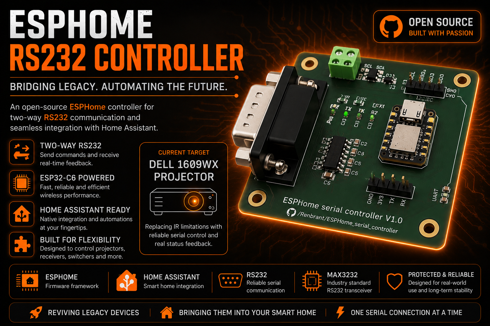

# ESPHome RS232 Controller (ESP32-C6)

An open-source **ESP32-C6** based solution designed to integrate legacy RS232 serial devices into **Home Assistant** via **ESPHome**.

---

## 🚀 Project Highlights

* **Bidirectional Communication:** Unlike IR, receive real-time status feedback (Power, Lamp Hours, Input Source) from your hardware.
* **Modern Platform:** Powered by the **ESP32-C6**, ensuring low power consumption and future-proofing for modern protocols.
* **Native ESPHome:** "Plug & Play" integration with Home Assistant using simple YAML configurations.
* **Dedicated Hardware:** Integrated MAX3232 transceiver with power filtering and ESD protection for reliable industrial-grade signals.

---

## 🛠️ Hardware Preview

The board is designed to be compact and modular, leveraging the Seeed Studio XIAO ecosystem.

  
  
  

 

### Technical Specifications:
* **MCU:** Seeed Studio XIAO ESP32-C6.
* **Serial Interface:** True RS232 via MAX3232.
* **Expandability:** Dedicated I2C header for external sensors and a debug UART header.
* **Form Factor:** Ultra-compact design, perfect for mounting behind projectors or inside AV racks.

---

## 📊 Dashboard Preview

Example of the Home Assistant dashboard showing real-time commands and status mapping for the projector via RS232:

  

---

## 💡 Why RS232 Over IR?

While Infrared (IR) is common, its one-way nature lacks reliability. By using the serial protocol, you gain:

1.  **True Status:** Confirm if a command was actually executed.
2.  **Advanced Metrics:** Monitor lamp hours, internal temperature, and error logs.
3.  **Rock-Solid Reliability:** No line-of-sight dependencies or interference from ambient lighting.
4.  **Smart Automation:** Create triggers based on actual device states (e.g., "Dim lights only when projector confirms Power On").

---

## 🏗️ Repository Structure

| Folder | Description |
| :--- | :--- |
| `Hardware/` | KiCad files, schematics, and PCB layouts. |
| `Firmware/` | ESPHome YAML configurations and automation logic. |
| `Docs/` | Development notes and device-specific protocols. |
| `PROMO/` | Visual assets and project renderings. |

---

## 🧪 Development Status

> [!WARNING]  
> **Experimental:** Firmware and entity mapping are currently under active development.

* **Current Target Device:** Dell 1609WX Projector.
* **PCB Status:** Functional and validated (V1.0).
* **Next Steps:** Implement protocol parsing for AV receivers (Denon/Onkyo) and refine state synchronization.

---

## 🤝 Contributions

This is an open-source project for the community. If you want to add support for new hardware or optimize the ESPHome logic, your contributions are welcome!

---

## ⚖️ License

This project is distributed as open-source hardware and software for hobbyist and educational use in home automation.
